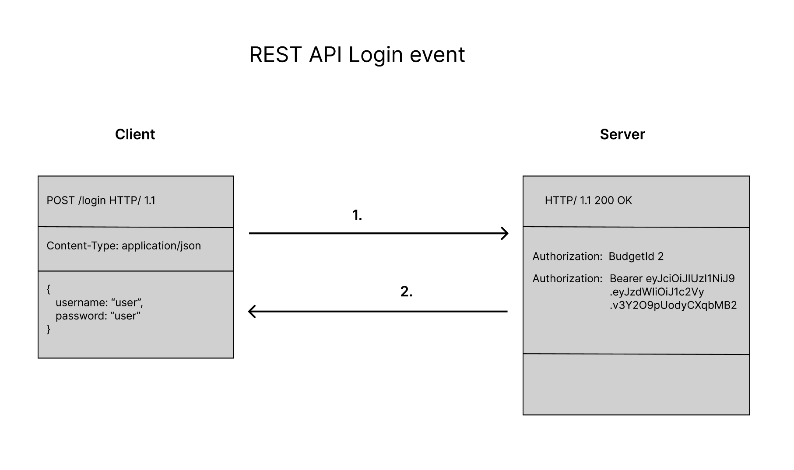
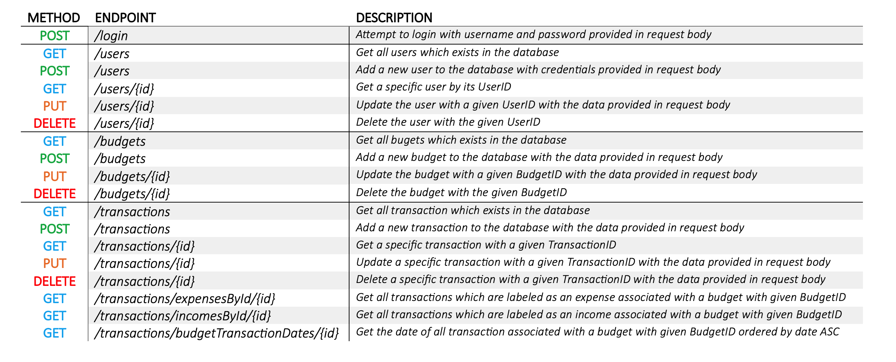

# API Implementation
---

## Architecture

The API which are used in this application are REST API's which utilizes the HTTP protocol for transferring data and files between a client and a server. While the server is running, it always listen for requests from clients to any of the following endpoints:

* /login
* /user
* /budget
* /transaction

When a client needs data, it sends a HTTP request with a given method, a set of parameters in its header, and eventually some data such as login-credentials in its body. The server receives this request and responds according to the definitions at the request-mappings at the different endpoints. The server will often respond with either data from the database, or with a status code such as 200 OK or 401 UNAUTHORIZED. The server accepts data from the body of a request in the form of a JSON object, and it will also respond with JSON objects in its body.

The implementation of the different controllers handling these requests are located in the web/api directory in this project. It fetches data using the CRUD Repository implementations at domain/repository, which returns tuples from the database represented through the Entity classes defined in domain/entity.

All but two endpoints requires authentication with a JSON Web Token in order to request data. These endpoints are:

| **Endpoint** | **Allowed HTTP method** |
|--------------|-------------------------|
| /login | _POST_ |
| /users | _POST_ |

The first endpoint is for authenticating a user which tries to log into their existing account. Their account credentials will be submitted in the request body. If the credentials are valid, the server will respond with status code 200 OK, and provide a JSON Web Token and the ID of the budget assigned to the user in the Authorization header. Should the credentials be invalid, the response will be 401 UNAUTHORIZED.

If a user wants to sign up with an account, there will be sent a request to the /users endpoint with the POST method, and with their suggested account credentials. The server will add the new user to the database along with a new budget instance for the new user to administrate, and respond with status code 201 CREATED. 

In order to access any of the other endpoints, the client will be required to provide a valid JSON Web Token in its Authorization header on each request. The JWT will be validated by the server upon each request before it responds with the requested data. Should it be that the JWT is either invalid or missing, the server will respond with 401 UNAUTHORIZED.

The RESTful APIs in this application has been implemented using the Spring Boot framework. For more information, visit [Spring Boot - Rest Services](https://spring.io/guides/tutorials/rest/).

## Testing

The API has been tested using three different approaches:

* Postman testing
* JUnit testing
* Testing through front-end application

Most of the testing has been performed through using the front-end application and asserting the presence of all expected data. This has been done both when the application has been deployed on localhost, and when it has been deployed on the internet through servers. This testing approach has been quite useful, since bugs which are of concern could easily be discovered while using the application as intended for the users. There are however a couple JUnit tests for testing the /login endpoint with valid and invalid account credentials in order to assert that the API is working. Furthermore, the API has been tested to some extent using Postman, where most of the endpoints has been tested several times. A couple of these tests has been exported to JSON-format, and are available in this directory.

In the earlier stages of the development of this application, some API tests was performed using a secondary database for testing-purposes. After implementing a functional GUI for the application on the web, later tests were performed from there as the developer team found it convenient and more appropriate.

## Documentation

The purpose of this file is to act as documentation for the API implementation for this application. The mechanics, architecture and testing of the API has been explained here. The actual implementations of the API in the web/api directory is also thoroughly documented using JavaDoc. This has been done to replace the usage of API documentation software such as Swagger.

### Illustrations

#### Authentication Scenario

This illustration is intended to describe what happens between client and server when a user attempts to sign in to the application:

#### API Endpoint Summary

This table lists every endpoint implemented in the application, the allowed methods, and an explanation of what they are for. Note that several of these endpoints are not used by the front-end application in the final build, but they are implemented still. This may be considered as a security hazard, but the developers has decided to let them stay so that they may be used in future developments. Some of these unused endpoints has however been used during testing in Postman, and for editing data which cannot be edited through the front-end application during the development process.

